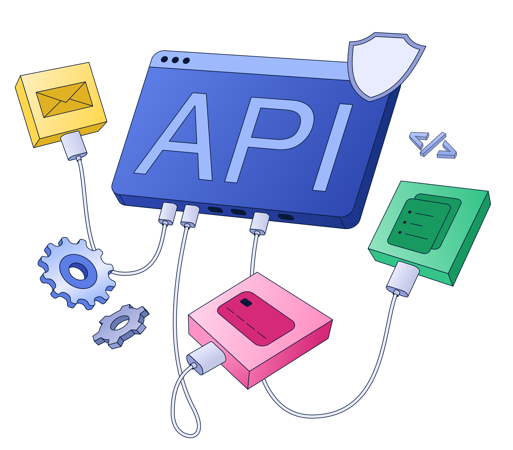

# Mega S4 API - Unsupported S3 Operations 


### This document lists all S3 operations and features that are **NOT supported** by Mega S4 API, based on [official documentation](https://github.com/meganz/s4-specs/blob/main/README.md) audit.

**Audit Date:** 2025-10-16  
**Source:** research-files/[mega-s4-readme.md](https://github.com/meganz/s4-specs/blob/main/README.md)  
**Node Status:** ✅ 100% Compliant (these features are not exposed)

---

## 📋 Complete Unsupported Operations Table

| Category | Operation/Feature | S3 Equivalent | Mega S4 Support | Impact | Alternative |
|----------|------------------|---------------|-----------------|--------|-------------|
| **ACL - Write** | PutBucketAcl | `PUT /{Bucket}?acl` | ❌ NO | Cannot set bucket ACLs | Use Bucket Policies |
| **ACL - Write** | PutObjectAcl | `PUT /{Bucket}/{Key}?acl` | ❌ NO | Cannot set object ACLs | Use Bucket Policies |
| **ACL - Headers** | x-amz-acl | Header in PUT requests | ❌ NO | ACL parameter ignored | Use Bucket Policies |
| **ACL - Headers** | x-amz-grant-read | Header in PUT requests | ❌ NO | Grant headers ignored | Use Bucket Policies |
| **ACL - Headers** | x-amz-grant-write | Header in PUT requests | ❌ NO | Grant headers ignored | Use Bucket Policies |
| **ACL - Headers** | x-amz-grant-read-acp | Header in PUT requests | ❌ NO | Grant headers ignored | Use Bucket Policies |
| **ACL - Headers** | x-amz-grant-write-acp | Header in PUT requests | ❌ NO | Grant headers ignored | Use Bucket Policies |
| **ACL - Headers** | x-amz-grant-full-control | Header in PUT requests | ❌ NO | Grant headers ignored | Use Bucket Policies |
| **Storage Class** | StorageClass selection | `x-amz-storage-class` header | ❌ NO | All objects are STANDARD | None - automatic |
| **Storage Class** | STANDARD_IA | Infrequent Access tier | ❌ NO | Not available | Use STANDARD |
| **Storage Class** | REDUCED_REDUNDANCY | Reduced redundancy tier | ❌ NO | Not available | Use STANDARD |
| **Storage Class** | GLACIER | Archive tier | ❌ NO | Not available | N/A |
| **Storage Class** | DEEP_ARCHIVE | Deep archive tier | ❌ NO | Not available | N/A |
| **Encryption** | Server-Side Encryption | `x-amz-server-side-encryption` | ❌ NO | No SSE support | Client-side encryption |
| **Encryption** | x-amz-server-side-encryption-customer-* | SSE-C headers | ❌ NO | Customer keys not supported | Client-side encryption |
| **Encryption** | x-amz-server-side-encryption-aws-kms-* | KMS headers | ❌ NO | KMS not supported | Client-side encryption |
| **Object Lock** | PutObjectLockConfiguration | Object lock settings | ❌ NO | Cannot lock objects | N/A |
| **Object Lock** | GetObjectLockConfiguration | Retrieve lock settings | ❌ NO | Not available | N/A |
| **Object Lock** | PutObjectRetention | Set retention period | ❌ NO | Cannot retain objects | N/A |
| **Object Lock** | GetObjectRetention | Get retention period | ❌ NO | Not available | N/A |
| **Object Lock** | PutObjectLegalHold | Set legal hold | ❌ NO | Not available | N/A |
| **Object Lock** | GetObjectLegalHold | Get legal hold status | ❌ NO | Not available | N/A |
| **Versioning** | PutBucketVersioning | Enable versioning | ❌ NO | No version support | N/A |
| **Versioning** | GetBucketVersioning | Check version status | ❌ NO | Not available | N/A |
| **Versioning** | ListObjectVersions | List all versions | ❌ NO | Not available | N/A |
| **Versioning** | DeleteObject (with versionId) | Delete specific version | ❌ NO | Not available | N/A |
| **Replication** | PutBucketReplication | Configure replication | ❌ NO | No replication support | Manual sync |
| **Replication** | GetBucketReplication | Get replication config | ❌ NO | Not available | N/A |
| **Replication** | DeleteBucketReplication | Remove replication | ❌ NO | Not available | N/A |
| **Lifecycle** | PutBucketLifecycleConfiguration | Set lifecycle rules | ❌ NO | No lifecycle management | Manual deletion |
| **Lifecycle** | GetBucketLifecycleConfiguration | Get lifecycle rules | ❌ NO | Not available | N/A |
| **Lifecycle** | DeleteBucketLifecycleConfiguration | Remove lifecycle | ❌ NO | Not available | N/A |
| **Logging** | PutBucketLogging | Enable access logs | ❌ NO | No server logs | Client-side logging |
| **Logging** | GetBucketLogging | Get log config | ❌ NO | Not available | N/A |
| **Analytics** | PutBucketAnalyticsConfiguration | Configure analytics | ❌ NO | No analytics support | External tools |
| **Analytics** | GetBucketAnalyticsConfiguration | Get analytics config | ❌ NO | Not available | N/A |
| **Analytics** | ListBucketAnalyticsConfigurations | List analytics | ❌ NO | Not available | N/A |
| **Metrics** | PutBucketMetricsConfiguration | Configure metrics | ❌ NO | No metrics support | External monitoring |
| **Metrics** | GetBucketMetricsConfiguration | Get metrics config | ❌ NO | Not available | N/A |
| **Metrics** | ListBucketMetricsConfigurations | List metrics | ❌ NO | Not available | N/A |
| **Inventory** | PutBucketInventoryConfiguration | Configure inventory | ❌ NO | No inventory support | Manual listing |
| **Inventory** | GetBucketInventoryConfiguration | Get inventory config | ❌ NO | Not available | N/A |
| **Inventory** | ListBucketInventoryConfigurations | List inventory | ❌ NO | Not available | N/A |
| **Website** | PutBucketWebsite | Host static website | ❌ NO | No website hosting | External hosting |
| **Website** | GetBucketWebsite | Get website config | ❌ NO | Not available | N/A |
| **Website** | DeleteBucketWebsite | Remove website | ❌ NO | Not available | N/A |
| **CORS** | PutBucketCors | Set CORS rules | ❌ NO | No CORS support | Proxy/Gateway |
| **CORS** | GetBucketCors | Get CORS rules | ❌ NO | Not available | N/A |
| **CORS** | DeleteBucketCors | Remove CORS | ❌ NO | Not available | N/A |
| **Tagging** | PutBucketTagging | Tag buckets | ❌ NO | No tagging support | Metadata |
| **Tagging** | GetBucketTagging | Get bucket tags | ❌ NO | Not available | Metadata |
| **Tagging** | DeleteBucketTagging | Remove tags | ❌ NO | Not available | Metadata |
| **Tagging** | PutObjectTagging | Tag objects | ❌ NO | No tagging support | Metadata |
| **Tagging** | GetObjectTagging | Get object tags | ❌ NO | Not available | Metadata |
| **Tagging** | DeleteObjectTagging | Remove tags | ❌ NO | Not available | Metadata |
| **Acceleration** | PutBucketAccelerateConfiguration | Enable acceleration | ❌ NO | No transfer acceleration | Direct transfers |
| **Acceleration** | GetBucketAccelerateConfiguration | Get acceleration | ❌ NO | Not available | N/A |
| **Notifications** | PutBucketNotificationConfiguration | Set notifications | ❌ NO | No event notifications | Polling/Webhooks |
| **Notifications** | GetBucketNotificationConfiguration | Get notifications | ❌ NO | Not available | N/A |
| **Request Payment** | PutBucketRequestPayment | Set requester pays | ❌ NO | Not supported | N/A |
| **Request Payment** | GetBucketRequestPayment | Get payment config | ❌ NO | Not available | N/A |
| **Presigned POST** | POST with presigned policy | POST /{Bucket} | ❌ NO | POST not supported | Use Presigned PUT |
| **Select** | SelectObjectContent | SQL queries on objects | ❌ NO | No S3 Select | Download & query |
| **Torrent** | GetObjectTorrent | Get torrent file | ❌ NO | No BitTorrent support | N/A |
| **Checksum** | ChecksumAlgorithm | SHA256/CRC32 checksums | ❌ NO | Only MD5 ETags | Use ETags |
| **Checksum** | x-amz-checksum-* headers | Checksum headers | ❌ NO | Not supported | Use ETags |
| **Location** | LocationConstraint | Specify region in body | ❌ NO | Region in endpoint | Set via endpoint |
| **Encoding** | EncodingType | URL encoding type | ❌ NO | Not supported | Manual encoding |
| **Intelligent Tiering** | IntelligentTieringConfiguration | Auto tier management | ❌ NO | Not supported | N/A |
| **Object Lambda** | WriteGetObjectResponse | Lambda processing | ❌ NO | Not supported | Pre/post-process |

---

## ✅ What IS Supported

### Fully Supported Operations (35 total)

#### Bucket Operations (9)
1. ✅ ListBuckets - List all buckets
2. ✅ CreateBucket - Create new bucket
3. ✅ DeleteBucket - Delete empty bucket
4. ✅ HeadBucket - Check bucket existence
5. ✅ GetBucketLocation - Get bucket region
6. ✅ GetBucketAcl - View bucket ACL (read-only)
7. ✅ GetBucketPolicy - Get bucket policy
8. ✅ PutBucketPolicy - Set bucket policy
9. ✅ DeleteBucketPolicy - Remove bucket policy

#### Object Operations (17)
1. ✅ ListObjects - List objects (v1)
2. ✅ ListObjectsV2 - List objects (v2, recommended)
3. ✅ PutObject - Upload object
4. ✅ GetObject - Download object
5. ✅ DeleteObject - Delete single object
6. ✅ DeleteObjects - Delete multiple objects
7. ✅ HeadObject - Get object metadata
8. ✅ CopyObject - Copy object
9. ✅ GetObjectAcl - View object ACL (read-only)
10. ✅ GetPresignedUploadUrl - Generate presigned PUT URL
11. ✅ GetPresignedDownloadUrl - Generate presigned GET URL
12. ✅ CreateMultipartUpload - Start multipart upload
13. ✅ UploadPart - Upload part
14. ✅ CompleteMultipartUpload - Finish multipart upload
15. ✅ AbortMultipartUpload - Cancel multipart upload
16. ✅ ListParts - List uploaded parts
17. ✅ ListMultipartUploads - List in-progress uploads

#### IAM Operations (9)
1. ✅ GetUser - Get IAM user details
2. ✅ ListUsers - List all IAM users
3. ✅ ListGroups - List all IAM groups
4. ✅ GetPolicy - Get policy document
5. ✅ GetPolicyVersion - Get specific policy version
6. ✅ ListPolicies - List all policies
7. ✅ ListAttachedUserPolicies - Get user's policies
8. ✅ ListAttachedGroupPolicies - Get group's policies
9. ✅ AttachUserPolicy - Attach policy to user

---

## 🎯 Access Control Recommendations

### ❌ Don't Use (Not Supported)
```javascript
// BAD - ACL operations don't work
await s3.send(new PutBucketAclCommand({ 
  Bucket: 'my-bucket',
  ACL: 'public-read' // ❌ Ignored by Mega S4
}));

await s3.send(new PutObjectCommand({
  Bucket: 'my-bucket',
  Key: 'file.txt',
  Body: data,
  ACL: 'private' // ❌ Ignored by Mega S4
}));
```

### ✅ Use Instead (Fully Supported)
```javascript
// GOOD - Bucket policies work perfectly
await s3.send(new PutBucketPolicyCommand({
  Bucket: 'my-bucket',
  Policy: JSON.stringify({
    Version: '2012-10-17',
    Statement: [{
      Effect: 'Allow',
      Principal: '*',
      Action: 's3:GetObject',
      Resource: 'arn:aws:s3:::my-bucket/*'
    }]
  })
}));

// GOOD - Read ACLs to view current permissions
const acl = await s3.send(new GetBucketAclCommand({
  Bucket: 'my-bucket'
}));
console.log('Current ACL:', acl); // ✅ Works
```

---

## 📊 Storage Class Behavior

### ❌ Don't Use (Not Supported)
```javascript
// BAD - StorageClass parameter ignored
await s3.send(new PutObjectCommand({
  Bucket: 'my-bucket',
  Key: 'file.txt',
  Body: data,
  StorageClass: 'STANDARD_IA' // ❌ Ignored, uses STANDARD anyway
}));
```

### ✅ Automatic Behavior (No Configuration Needed)
```javascript
// GOOD - All objects automatically use STANDARD
await s3.send(new PutObjectCommand({
  Bucket: 'my-bucket',
  Key: 'file.txt',
  Body: data
  // No StorageClass needed - defaults to STANDARD
}));

// Verify storage class
const response = await s3.send(new ListObjectsV2Command({
  Bucket: 'my-bucket'
}));
console.log(response.Contents[0].StorageClass); // Always "STANDARD"
```

---

## 💡 Best Practices

### 1. Use Bucket Policies for Access Control
- ✅ Full IAM integration
- ✅ Fine-grained permissions
- ✅ JSON-based policies
- ✅ Supports wildcards and conditions

### 2. Accept STANDARD Storage Class
- ℹ️ All objects use STANDARD automatically
- ℹ️ No additional configuration needed
- ℹ️ No performance differences
- ℹ️ No cost tiers

### 3. Use ETags for Integrity
- ✅ MD5 hash available in ETags
- ✅ Reliable for comparing objects
- ❌ Don't expect SHA256/CRC32 checksums

### 4. Presigned URLs
- ✅ Use Presigned PUT for uploads
- ✅ Use Presigned GET for downloads
- ❌ Don't use Presigned POST (not supported)

### 5. Client-Side Encryption
- ℹ️ No server-side encryption available
- ✅ Encrypt data before upload if needed
- ✅ Manage keys yourself

---

## 🔍 Detection & Error Handling

### How to Detect Unsupported Features

```javascript
try {
  // Attempt unsupported operation
  await s3.send(new PutBucketAclCommand({ 
    Bucket: 'my-bucket',
    ACL: 'public-read'
  }));
} catch (error) {
  if (error.Code === 'NotImplemented' || error.Code === 'InvalidArgument') {
    console.log('Feature not supported by Mega S4');
    // Fall back to bucket policy
  }
}
```

### Common Error Messages
- `NotImplemented` - Operation not supported
- `InvalidArgument` - Parameter not supported
- Headers silently ignored (no error, but no effect)

---

**Devs Note:** This document is based on official Mega S4 API documentation audit performed on 2025-10-16. All 35 operations in the n8n-nodes-mega node are compliant with this specification.

**Dev Source Documents:**
- `research-files/mega-s4-readme.md` - Official API documentation (Hidden)
- `dev-docs/API_COMPLIANCE_FINAL_REPORT.md` - Compliance audit report  (Hidden)
- `dev-docs/STEP19_API_COMPLIANCE_COMPLETE.md` - Implementation summary (Hidden)
